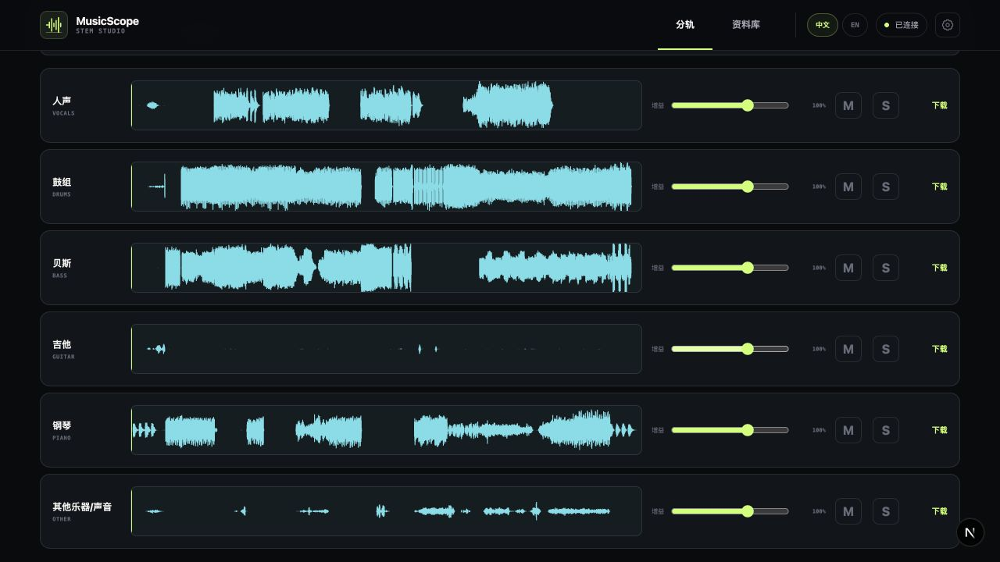
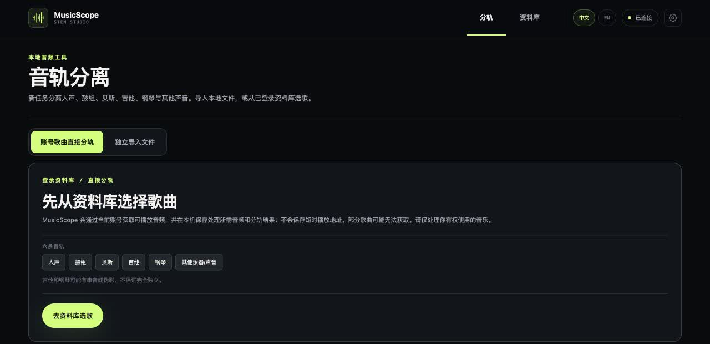
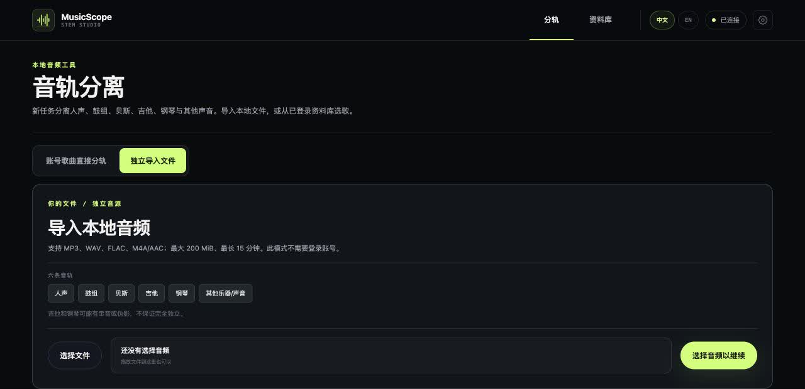

# MusicScope

**把喜欢的歌，拆成可以聆听、练习和再创作的六条音轨。**

A local-first six-stem studio for the music already in your library.

**先看实际界面：** [六轨混音与导出](https://github.com/sevenlemoon/MusicScope-V2/blob/master/docs/screenshots/studio-mixer.jpg) · [网易云账号选歌](https://github.com/sevenlemoon/MusicScope-V2/blob/master/docs/screenshots/studio-account.jpg) · [本地文件导入](https://github.com/sevenlemoon/MusicScope-V2/blob/master/docs/screenshots/studio-local.jpg)



上图是完成分轨后的真实界面：每条音轨都能单独调音量、静音、独奏和下载。截图已避开私人曲名。

MusicScope 专注于一件事：从自己的音频文件，或网易云账号“我喜欢的音乐”中的**可播放歌曲**，直接生成同步的 **人声、鼓、贝斯、吉他、钢琴、其他** 六条音轨。界面围绕选曲、分离、试听和导出设计，不需要先经过推荐或数据洞察页面。

## 两种分轨入口

进入项目就是分轨页面，按音源选择一种入口。图片下方也提供了文字链接，方便图片未加载时查看。

### 1. 网易云账号选歌

扫码连接后，从资料库挑选当前账号可取得可播放音源的歌曲，直接在本机分轨。



[在 GitHub 打开账号选歌截图](https://github.com/sevenlemoon/MusicScope-V2/blob/master/docs/screenshots/studio-account.jpg)

### 2. 独立导入本地文件

导入自己的 MP3、WAV、FLAC 或 M4A/AAC 音频，不需要登录账号。



[在 GitHub 打开本地导入截图](https://github.com/sevenlemoon/MusicScope-V2/blob/master/docs/screenshots/studio-local.jpg)

两张入口截图均裁去了最近任务，避免公开私人歌名。

## 为什么用它

- **两种入口**：拖入本地音频；或扫码连接网易云，从“我喜欢的音乐”选择歌曲。账号曲目只有在当前账号可取得可播放音源时才能分离。
- **六轨而非笼统的伴奏**：Demucs 将人声、鼓、贝斯、吉他、钢琴和其他声音分别导出为 FLAC；各轨保持同步。
- **边听边练**：逐轨调音量、静音或独奏，调速、循环、拖动波形；新任务还会在鼓轨节奏足够稳定时显示**估算 BPM 和节拍标记**。
- **本机优先**：音频处理、资料库和账号连接在本机运行；登录会话留在服务端，不交给浏览器。提供中英文界面。

资料库中的曲目来自“我喜欢的音乐”；歌单显示账号自己创建的，专辑显示账号明确收藏的，不会把所有喜欢歌曲涉及的专辑误算成收藏。资料库页可单独更新收藏专辑，无需重扫所有歌单。艺人仅作为曲目和专辑的署名信息显示，不提供独立分类；资料库也不推断播放次数。早期推荐、演唱会和 Insights 代码仍在仓库中，但不属于当前核心流程。

## 在本机运行

| 平台 | 启动方式 | 必需软件 |
| --- | --- | --- |
| macOS（Apple silicon） | 双击 `MusicScope.command`，或运行 `./scripts/dev.sh` | Docker Desktop、[uv](https://docs.astral.sh/uv/)、Node.js 24.21.0+（24.x）；首次在仓库中运行 `nvm install` |
| Windows 10/11 x64 | 双击 `MusicScope.cmd`，或在 PowerShell 运行 `./scripts/dev.ps1` | Docker Desktop、[uv](https://docs.astral.sh/uv/)、Node.js 24.21.0+（24.x）、[FFmpeg](https://ffmpeg.org/download.html)（`ffmpeg` 和 `ffprobe` 在 PATH） |

Windows 和 macOS 的启动器都会自动准备隔离的 Python 3.12 环境、安装锁定依赖、启动本机 PostgreSQL 并执行前向数据库迁移。首次安装 Demucs/PyTorch 和模型时需要下载，且会占用较多磁盘空间；长音频的 CPU 分离可能很慢。macOS 默认优先使用 MPS，Windows 在检测到可用 CUDA 时使用 CUDA，否则使用 CPU；可在本地 `.env` 中将 `AUDIO_WORKER_DEVICE=cpu` 作为明确的 CPU 重试。Windows 用户无需在 WSL 终端中启动本项目；Docker Desktop 的后端要求仍取决于其安装方式。

可选启动参数：macOS 为 `./scripts/dev.sh --status|--setup|--no-open`；Windows 为 `./scripts/dev.ps1 -Status|-Setup|-NoOpen`。状态模式只读取状态。关闭启动窗口会停止由该窗口启动的应用进程，PostgreSQL 数据卷保留。启动器不会自动同步网易云、删除资料库或清除 Docker 卷。

Windows 安装 FFmpeg 后请新开一个 PowerShell 窗口，用 `ffmpeg -version` 和 `ffprobe -version` 确认 PATH 已生效。若双击被 Windows 安全提示拦截，可在 PowerShell 中从已检查的仓库目录启动 `./MusicScope.cmd`；不需要修改全局执行策略。

## 技术结构

```text
Next.js / React / TypeScript
          → FastAPI / SQLAlchemy → 本机 PostgreSQL
          → 网易云连接服务（仅本机）
          → 独立 Python 音频 worker → Demucs → 六条 FLAC 音轨
```

本机 `.env` 会生成独一份数据库密码和加密密钥，且已被 Git 忽略。Windows 启动器会收紧该文件的 ACL；macOS 使用仅文件所有者可读写的权限。请勿提交或分享 `.env`、账号会话、分轨源文件和模型缓存。更多设计见 [架构](docs/ARCHITECTURE.md) 与 [领域模型](docs/DOMAIN_MODEL.md)。

## 验证与边界

macOS/Linux 开发验证：`make check`。GitHub Actions 运行 Linux 全量检查与 Windows 原生 Python、前端和启动器检查。Windows 自动化检查不能替代所有 Windows 硬件、声卡或 GPU 上的完整模型分离实测。

节拍/BPM 是从新分离任务的鼓轨**估算**，不是乐谱级精确转录；节奏证据不足时不会显示数字，旧任务也不会凭空补出节拍。分离结果可能有串音或伪影。账号选曲取决于该账号是否能取得合法可播放音源；请只处理自己有权使用的音乐。

MusicScope 当前仅支持**单机本地使用**：服务绑定 `127.0.0.1`，不应直接开放到局域网或公网。开发用的 `X-MusicScope-User-ID` 不是身份验证；共享部署需要重新设计认证、TLS 与安全边界。
